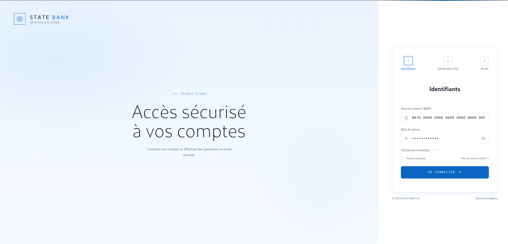

<p></p>


# State-Bank-Solution
Bank App solution for training 

A comprehensive banking application developed as part of my computer science curriculum to validate and deepen my skills in software architecture, Object-Oriented Programming in Java, and Client-Server communication.

The objective of this project is to simulate a robust backend banking system capable of managing the complex business logic of 100 mock clients, and exposing it through a modern, dynamic web interface.

---

## Technical Stack

* **Frontend:** HTML5, CSS3 (Modern and responsive design), JavaScript (ES6+, synchronous/asynchronous Fetch API).
* **Backend:** Java (N-Tier Architecture), Spring Boot (REST API development).
* **Modeling:** UML 2.0 designed with Gaphor (Debian).

---

## Architecture and Design

Before writing any code, the entire system was modeled to guarantee robust relationships between entities and strict adherence to encapsulation principles.

### UML Class Diagram
The project relies on a strict Object-Oriented structure:
* A `Client` class holding a composition of accounts.
* An abstract `Account` class specialized into `CurrentAccount` (with overdraft management) and `SavingsAccount` (with interest rates).
* An immutable `Transaction` class for the financial ledger.

## Key Features

### 1. Mass Data Generation (Mocking)
* Initialization of **100 unique clients** generated randomly at startup (dynamic combination of first/last names, creation of valid IBANs with the FR76 format).
* Allocation of varied, realistic balances and initialization of distinct transaction histories.

### 2. Business Logic and Financial Accuracy (Java)
* **Monetary Precision:** Exclusive use of the `BigDecimal` type for all balances and calculations, preventing binary rounding errors inherent to `double` or `float` types.
* **Strict Transfer Management:** Control of account-to-account flows (prohibition of negative amounts, validation of account existence, blockages in case of insufficient funds).

### 3. Robust Exception Handling
* Implementation of custom business exceptions (e.g., `InsufficientFundsException`, `AccountNotFoundException`).
* Interception of backend errors to return appropriate HTTP status codes (400 Bad Request) to the frontend.

### 4. Fluid User Interface (JavaScript)
* Asynchronous dashboard using the `Fetch` API to query the Java server without page reloads.
* Instant update of balances and transaction tables upon validation of a transfer.
* Visual state management (errors displayed in red, successes in green, button deactivation during requests).

---

## Backend Project Structure

The Java code strictly follows the N-Tier layered architecture:

```text
src/main/java/com/fakebank/
│
├── controllers/     # Intercepts HTTP requests, validates incoming JSON
├── services/        # Contains all business logic (transfers, 100 clients generation)
├── models/          # Data entities (Client, Account, Transaction)
└── exceptions/      # Custom banking system exceptions
